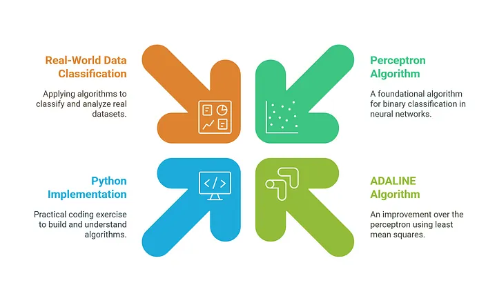

# **Building Perceptron and ADALINE from Scratch: A Practical Guide to Binary Classification**

## **TL;DR**

Understanding the foundations of neural networks is crucial for anyone diving into machine learning. This article explores how to implement **Perceptron** and **ADALINE** from scratch in Python using the **Breast Cancer Wisconsin dataset** for binary classification. We cover the theory behind these early neural network models, provide implementation details, and outline key learnings from training and visualizing decision boundaries.

---

## **Introduction: Why Study Perceptron and ADALINE?**

Neural networks power modern AI applications, but their foundations were laid in the **1950s and 1960s** with the development of **Perceptron** and **ADALINE**. Studying these models helps understand:

- **How single-layer neural networks work**
- **The mathematical principles behind classification**
- **Gradient descent and learning rules in neural networks**
- **The limitations of early neural networks and why deeper architectures emerged**

This article provides a step-by-step guide to implementing these models, from **theory** to **Python implementation** and **practical experimentation**.

---

## **Project Overview and Structure**

The goal of this project is to implement **Perceptron and ADALINE from scratch** for **binary classification**. The dataset used is the **Breast Cancer Wisconsin dataset**, which contains **30 numerical features** used to classify tumors as **malignant or benign**.

### **Project Structure**
The project follows a structured approach to ensure easy navigation and reproducibility.

```
ml-from-scratch/2025-03-04-perceptron-adaline/
├── data/
│   ├── breast_cancer.csv  # Raw dataset
│   ├── X_train_std.csv  # Standardized training data
│   ├── X_test_std.csv  # Standardized test data
│   ├── y_train.csv  # Training labels
│   ├── y_test.csv  # Test labels
├── notebooks/
│   ├── Perceptron_Visualization.ipynb  # Decision boundary visualization
├── src/
│   ├── data_preprocessing.py  # Standardizes and preprocesses data
│   ├── perceptron.py  # Perceptron class
│   ├── train_perceptron.py  # Training script for Perceptron
│   ├── plot_decision_boundary.py  # Visualizing Perceptron results
│   ├── adaline.py  # ADALINE class
│   ├── train_adaline.py  # Training script for ADALINE
│   ├── plot_adaline_decision_boundary.py  # Visualizing ADALINE results
│   ├── plot_adaline_loss.py  # Learning curve visualization
├── models/
│   ├── perceptron_model_2feat.npz  # Trained Perceptron model
│   ├── adaline_model_2feat.npz  # Trained ADALINE model
├── requirements.txt  # Dependencies
├── README.md  # Project Documentation
```

📌 **GitHub Repository:** [ml-from-scratch - Perceptron & ADALINE](https://github.com/shanojpillai/ml-from-scratch/tree/main/2025-03-04-perceptron-adaline)

---

## **Project Implementation & Running the Project**

### **1️⃣ Set Up the Environment**
```bash
pip install -r requirements.txt
```

### **2️⃣ Preprocess the Data**
```bash
python src/data_preprocessing.py
```

### **3️⃣ Train the Perceptron Model**
```bash
python src/train_perceptron.py
```

### **4️⃣ Train the ADALINE Model**
```bash
python src/train_adaline.py
```

### **5️⃣ Visualize Perceptron Decision Boundary**
```bash
python src/plot_decision_boundary.py
```

### **6️⃣ Visualize ADALINE Learning Curve**
```bash
python src/plot_adaline_loss.py
```

## **Theory: Understanding Perceptron and ADALINE**

### **Perceptron Algorithm**

**Developed by Frank Rosenblatt in 1957**, the Perceptron is one of the earliest single-layer neural networks. It is a **linear classifier** that updates its weights based on misclassified examples.

#### **Mathematical Formulation**
For an input vector **X** = [x₁, x₂, ..., xₙ]:

1. Compute the weighted sum:
   
   **z = (w₁x₁ + w₂x₂ + ... + wₙxₙ) + bias**

2. Apply the **activation function (step function)**:
   
   **ŷ = 1 if z > 0, else -1**

3. Update weights and bias for misclassified examples:
   
   **wᵢ ← wᵢ + η (y - ŷ) xᵢ**
   
   **bias ← bias + η (y - ŷ)**
   
   where **η** is the learning rate.

#### **Limitations**
- The Perceptron can **only classify linearly separable data**.
- It does **not use gradient descent**, which limits learning efficiency.

---

### **ADALINE Algorithm**

**Developed by Bernard Widrow and Marcian Hoff in 1960**, ADALINE (Adaptive Linear Neuron) improves upon the Perceptron by using a **continuous activation function** instead of a step function.

#### **Mathematical Formulation**
1. Compute the output **ŷ** using a linear function:
   
   **ŷ = w₁x₁ + w₂x₂ + ... + wₙxₙ + bias**

2. Compute the **cost function (Mean Squared Error - MSE)**:
   
   **E = (1/2) Σ(y - ŷ)²**

3. Use **gradient descent** to update weights:
   
   **wᵢ ← wᵢ + η Σ(y - ŷ) xᵢ**
   
   **bias ← bias + η Σ(y - ŷ)**

#### **Advantages Over Perceptron**
- ADALINE uses **gradient descent**, leading to **smoother learning**.
- It **converges better** since it minimizes an explicit cost function.
- However, it **still requires linearly separable data** for effective classification.

---

## **Project Implementation & Running the Project**

### **1️⃣ Set Up the Environment**
```bash
pip install -r requirements.txt
```

### **2️⃣ Preprocess the Data**
```bash
python src/data_preprocessing.py
```

### **3️⃣ Train the Perceptron Model**
```bash
python src/train_perceptron.py
```

### **4️⃣ Train the ADALINE Model**
```bash
python src/train_adaline.py
```

### **5️⃣ Visualize Perceptron Decision Boundary**
```bash
python src/plot_decision_boundary.py
```

### **6️⃣ Visualize ADALINE Learning Curve**
```bash
python src/plot_adaline_loss.py
```

---

## **Results and Key Learnings**

1. **Perceptron only works for linearly separable data.**
2. **ADALINE converges better due to gradient descent.**
3. **Using only two features simplifies decision boundary visualization.**
4. **Real-world applications require multilayer networks for complex patterns.**

### **Future Work**
- Implement **Multilayer Perceptron (MLP)** for **non-linear decision boundaries**.
- Extend to **more complex datasets (e.g., MNIST)**.
- Experiment with **different learning rates and activation functions**.

---

## **References**

- [Breast Cancer Wisconsin Dataset - Kaggle](https://www.kaggle.com/uciml/breast-cancer-wisconsin-data)
- [Perceptron Wikipedia](https://en.wikipedia.org/wiki/Perceptron)
- [ADALINE Wikipedia](https://en.wikipedia.org/wiki/Adaline)

---

## **Conclusion**

Perceptron and ADALINE lay the foundation for modern neural networks. While limited to **linear classification**, they provide valuable insights into how learning occurs in neural models. Implementing these from scratch builds intuition for **weight updates, learning rules, and activation functions**, essential for understanding **deep learning architectures**.

Would you like to explore **deep learning next?** Let’s discuss in the comments! 🚀

