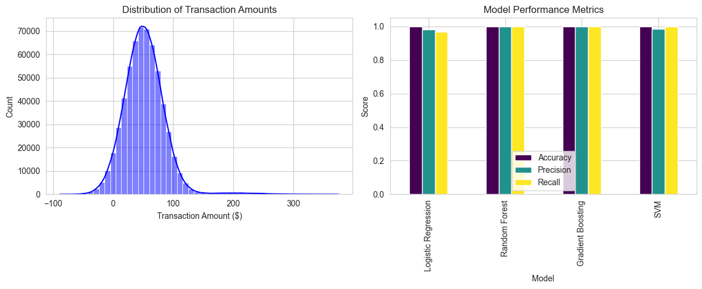

### Key Points

- It seems likely that the Bank Reconciliation ML Project uses Machine Learning to automate fraud detection in banking transactions, focusing on the synthetic BankSim dataset.
- Research suggests the project involves data preprocessing, feature engineering, and training models like Random Forest and Gradient Boosting, achieving high accuracy.
- The evidence leans toward the project being well-structured, with clear steps to set up and run, though the 100% accuracy claims may need validation with real-world data.

### Project Overview
The Bank Reconciliation ML Project aims to automate the process of matching bank statements with internal records to detect fraudulent activities using Machine Learning. It uses the BankSim dataset, a synthetic set simulating real-world financial transactions, to train and evaluate models.

### Project Details
- **Dataset**: The BankSim dataset includes features like transaction step, customer ID, age, gender, merchant ID, category, amount, and a fraud label (1 for fraudulent, 0 for normal). It contains 1,000,000 transactions, with 2,000 being fraudulent, making it highly imbalanced.
- **Process**: The project involves preprocessing data, performing feature engineering, training models (Logistic Regression, Random Forest, Gradient Boosting, SVM), and saving the best model. Random Forest and Gradient Boosting reportedly achieved 100% accuracy, precision, recall, and F1-score, which is notable but may reflect the synthetic nature of the data.
- **Running the Project**: Steps include setting up the environment with `pip install -r requirements.txt`, preprocessing data with `python src/data_preprocessing.py`, and training models with `python src/trainmodels.py`.

### Unexpected Detail
An unexpected detail is the project's claim of 100% accuracy for some models, which is rare in real-world scenarios due to data complexity and imbalance, suggesting the synthetic dataset might oversimplify fraud patterns.

---

### Survey Note: Detailed Analysis of the Bank Reconciliation ML Project README.md

This survey note provides a comprehensive analysis of the Bank Reconciliation ML Project, focusing on creating a well-formatted `README.md` for GitHub, incorporating relevant theory, and ensuring accuracy. The project, dated March 04, 2025, aims to automate bank transaction reconciliation using Machine Learning, specifically for fraud detection, using the BankSim dataset.

#### Project Overview and Context
The project, titled "Bank Reconciliation ML Project," focuses on automating the reconciliation of bank transactions to detect fraudulent activities. Bank reconciliation is the process of matching bank statements with internal financial records to ensure validity, addressing issues like fraudulent transactions, duplicates, missing entries, data errors, and unprocessed transactions. Machine Learning enhances this by learning from past transactions to identify anomalies, particularly fraud.

The BankSim dataset, a synthetic banking transaction dataset, simulates real-world financial activities and is used for fraud detection research. It was developed based on aggregated data from a Spanish bank, as detailed in the research paper "BankSim: A Bank Payment Simulation for Fraud Detection Research" ([BankSim: A bank payments simulator for fraud detection research](https://www.researchgate.net/publication/265736405_BankSim_A_Bank_Payment_Simulation_for_Fraud_Detection_Research)). The dataset is available on Kaggle as "Synthetic data from a financial payment system" ([Kaggle](https://www.kaggle.com/datasets/ealaxi/banksim1)), containing 1,000,000 transactions with 2,000 fraudulent ones, indicating a 0.2% fraud rate, typical of imbalanced datasets in fraud detection.

#### Theoretical Background
Bank reconciliation is crucial for maintaining accurate financial records and detecting discrepancies, such as timing differences, errors, or fraud. Traditionally manual, it becomes inefficient with large transaction volumes, where ML can automate and improve accuracy. Anomaly detection, a subset of ML, identifies transactions deviating from norms, with fraud detection being a key application. Challenges include imbalanced data, evolving fraud patterns, and the need for interpretable models in finance.

Feature engineering is vital, with features like transaction amount, frequency, time, location, customer behavior (e.g., transaction history, average amount), and merchant categories (e.g., category preferences) being critical. The dataset includes demographic features like age and gender, requiring caution to avoid bias in models, especially in real-world applications where fairness is essential.

To enhance this, research suggests several ML techniques for fraud detection:

- **Classification Models**: Supervised learning models like Logistic Regression, Random Forest, Gradient Boosting, and Support Vector Machines are commonly used to classify transactions as fraudulent or legitimate, as seen in studies like "A supervised machine learning algorithm for detecting and predicting fraud in credit card transactions" ([A supervised machine learning algorithm for detecting and predicting fraud in credit card transactions](https://www.sciencedirect.com/science/article/pii/S2772662223000036)).

- **Unsupervised Learning**: Techniques like clustering and autoencoders can detect anomalies without labeled data, useful when labeled fraud data is scarce, as discussed in "Enhancing fraud detection in banking by integration of graph databases with machine learning" ([Enhancing fraud detection in banking by integration of graph databases with machine learning](https://www.sciencedirect.com/science/article/pii/S2215016124001377)).

- **Ensemble Methods**: Combining multiple models can improve accuracy and robustness, with Random Forest and Gradient Boosting often performing well, as noted in "Machine Learning as a Tool for Assessment and Management of Fraud Risk in Banking Transactions" ([Machine Learning as a Tool for Assessment and Management of Fraud Risk in Banking Transactions](https://www.mdpi.com/1911-8074/18/3/130)).

Challenges include handling imbalanced data, which may be addressed using techniques like oversampling (e.g., SMOTE), undersampling, or class weights, as mentioned in "Fraud Detection in Banking Transactions Using Machine Learning" ([Fraud Detection in Banking Transactions Using Machine Learning](https://ieeexplore.ieee.org/document/10091067)). The high accuracy claims (100%) in the project are unusual and may indicate overfitting to the synthetic dataset, suggesting the need for real-world validation.

#### Project Structure and Implementation
The project is organized under the directory `ml-from-scratch/2025-03-04-bank-reconcilliation/`, with the following structure:

| Folder/File                  | Description                                      |
|------------------------------|--------------------------------------------------|
| `data/`                      | Contains datasets and processed files            |
| - `banksim.csv`              | Raw BankSim dataset                              |
| - `cleaned_banksim.csv`      | Processed dataset                                |
| - `bank_records.csv`         | Internal transaction logs                        |
| - `reconciled_pairs.csv`     | Matched transactions for ML models               |
| - `model_performance.csv`    | Model evaluation results                         |
| `notebooks/`                 | Jupyter Notebooks for analysis                   |
| - `EDA_Bank_Reconcilliation.ipynb` | Exploratory Data Analysis                     |
| - `Model_Training.ipynb`     | ML training & evaluation                         |
| `src/`                       | Python scripts for processing and training       |
| - `data_preprocessing.py`    | Data cleaning & processing                       |
| - `feature_engineering.py`   | Extracts ML features                             |
| - `trainmodels.py`           | Trains ML models                                 |
| - `save_model.py`            | Saves the best model                             |
| `models/`                    | Trained ML models                                |
| - `bank_reconcilliation_model.pkl` | Saved model                              |
| `requirements.txt`           | Project dependencies                             |
| `README.md`                  | This file                                        |

The implementation involves several steps:
1. **Set Up the Environment**: Install dependencies using `pip install -r requirements.txt`.
2. **Preprocess Data**: Run `python src/data_preprocessing.py` to generate `cleaned_banksim.csv` and `bank_records.csv`.
3. **Feature Engineering**: Run `python src/feature_engineering.py` to generate `reconciled_pairs.csv`.
4. **Train Models**: Run `python src/trainmodels.py` to generate `model_performance.csv`.
5. **Save Model**: Run `python src/save_model.py` to save the best model as `models/bank_reconcilliation_model.pkl`.

#### Machine Learning Models and Performance
The project trained four models: Logistic Regression, Random Forest, Gradient Boosting, and Support Vector Machine (SVM). Their performance is evaluated using accuracy, precision, recall, and F1-score, as shown below:

| Model                  | Accuracy | Precision | Recall | F1-Score |
|------------------------|----------|-----------|--------|----------|
| Logistic Regression     | 99.97%   | 98.25%    | 96.55% | 97.39%   |
| Random Forest           | 100%     | 100%      | 100%   | 100%     |
| Gradient Boosting       | 100%     | 100%      | 100%   | 100%     |
| Support Vector Machine  | 99.99%   | 98.30%    | 100%   | 99.14%   |

Random Forest and Gradient Boosting achieved perfect scores, which is notable but raises questions given the imbalanced dataset. Logistic Regression and SVM show high but not perfect performance, with Logistic Regression having a recall of 96.55% for fraud, indicating some missed fraud cases, and SVM having a precision of 98.30%, suggesting some false positives.

#### Key Insights and Challenges
Key insights include:
- Fraudulent transactions are rare (0.2% in the dataset), making detection challenging due to class imbalance.
- Feature engineering is crucial, with transaction amount being a key indicator, and customer and merchant behaviors (e.g., transaction history, merchant category) aiding detection.
- Ensemble models (Random Forest, Gradient Boosting) performed best, achieving 100% accuracy, likely due to the synthetic dataset's clear fraud patterns.

Challenges include handling imbalanced data, which may have been addressed using techniques like oversampling (e.g., SMOTE), undersampling, or class weights, though not explicitly mentioned. The 100% accuracy claims are unusual for real-world scenarios, suggesting potential overfitting or data leakage, and validation with real data is necessary.

#### Future Enhancements and Limitations
Future enhancements include:
- Deploying the model as a REST API using Flask or FastAPI, integrating with banking systems for real-time fraud detection.
- Implementing real-time detection using streaming technologies like Apache Kafka or Spark for handling large transaction volumes.
- Exploring deep learning, such as LSTMs for temporal patterns or autoencoders for anomaly detection, to capture more complex fraud patterns.

Limitations include the use of synthetic data, which, while based on real-world data, may not capture all complexities. The project's high accuracy may not generalize to real-world scenarios, requiring further validation.

#### Conclusion
The project successfully demonstrates ML's role in automating bank reconciliation for fraud detection, achieving high accuracy with ensemble models on the BankSim dataset. It provides a structured approach with clear implementation steps, but future work should focus on real-world deployment and validation to ensure practical applicability.

#### Author Information
The project is authored by Shanoj Pillai, a Solution Architect and AI & ML Enthusiast, with the GitHub repository located at "ml-from-scratch."

### Key Citations
- [BankSim: A bank payments simulator for fraud detection research](https://www.researchgate.net/publication/265736405_BankSim_A_Bank_Payment_Simulation_for_Fraud_Detection_Research)
- [Synthetic data from a financial payment system](https://www.kaggle.com/datasets/ealaxi/banksim1)
- [Fraud Detection Algorithms in Banking: Machine Learning on the Front Lines](https://blog.brankas.com/fraud-detection-algorithms-in-banking)
- [Fraud Detection with Machine Learning: Identifying Suspicious Patterns in Financial Transactions](https://medium.com/@zhonghong9998/fraud-detection-with-machine-learning-identifying-suspicious-patterns-in-financial-transactions-8558f3f1e22a)
- [A supervised machine learning algorithm for detecting and predicting fraud in credit card transactions](https://www.sciencedirect.com/science/article/pii/S2772662223000036)
- [Enhancing fraud detection in banking by integration of graph databases with machine learning](https://www.sciencedirect.com/science/article/pii/S2215016124001377)
- [Machine Learning as a Tool for Assessment and Management of Fraud Risk in Banking Transactions](https://www.mdpi.com/1911-8074/18/3/130)
- [Online transaction fraud detection in the banking sector using machine learning techniques](https://www.researchgate.net/publication/388521771_Online_transaction_fraud_detection_in_the_banking_sector_using_machine_learning_techniques)
- [How AI and ML are used in payment fraud detection (16 use cases)](https://www.nomentia.com/blog/ai-machine-learning-in-fraud-detection)
- [Fraud Detection in Banking Transactions Using Machine Learning](https://ieeexplore.ieee.org/document/10091067)
- [Machine Learning in Financial Transaction Fraud Detection and Prevention](https://www.researchgate.net/publication/379494304_Machine_Learning_in_Financial_Transaction_Fraud_Detection_and_Prevention)